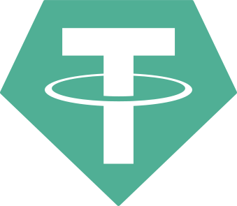

# KOSH - Multi-Chain Cryptocurrency Wallet

<div align="center">

<h1 align="center">KOSH</h1>
<h2>Secure Multi-Chain HD Wallet with Enhanced Security</h2>
</div>

## 🚀 Features

- **🔐 Enhanced Security**: PBKDF2 key derivation, secure encryption, and no sensitive data logging
- **💼 HD Wallet Support**: Hierarchical deterministic wallet with multiple addresses across multiple chains
- **📱 PWA Ready**: Installable web app with offline support
- **🎨 Modern UI**: Clean, responsive interface built with Vue 3 and Tailwind CSS
//TODO - **🔄 Real-time Balance**: Live balance tracking for USDT and native tokens across all supported chains
- **📤 Send/Receive**: Full transaction support with proper validation
- **💾 Backup/Restore**: Secure wallet backup and restoration
- **⚡ Fast**: Optimized performance with Nuxt 3
- **🌐 Multi-Chain Support**: TRON (TRC20), Ethereum (ERC20), and BSC (BEP20) support
- **⚙️ Custom RPC**: Configurable RPC endpoints for all supported chains

## 🛡️ Security Improvements

This version includes major security enhancements:

- **PBKDF2 Key Derivation**: 10,000 iterations with random salt for password-based key derivation
- **AES-256 Encryption**: Secure encryption with random IV for all sensitive data
- **No Console Logging**: Sensitive data is never logged to the console
- **Password Validation**: Strong password requirements (8+ characters, mixed case, numbers, symbols)
- **Secure Storage**: Improved localStorage encryption for wallet data
- **Error Handling**: Comprehensive error management without exposing sensitive information
- **TypeScript**: Full type safety throughout the application
- **Memory Cleanup**: Best-effort secure memory cleanup for sensitive data

## 📋 Requirements

- **Node.js**: Version 18.x or higher
- **NPM**: Version 9.x or higher
- **Modern Browser**: Chrome 88+, Firefox 78+, Safari 14+

## 🚀 Quick Start

### Installation

```bash
# Clone the repository
git clone <repository-url>
cd USDT

# Install dependencies
npm install

# Start development server
npm run dev
```

### Development

```bash
# Start development server
npm run dev

# Build for production
npm run build

# Preview production build
npm run preview
```

### PWA Installation

1. Open the app in a modern browser
2. Look for the "Install" prompt or menu option
3. Click "Install" to add to your device

## 🏗️ Architecture

```
src/
├── components/          # Vue components (UI elements)
├── services/           # Business logic and blockchain services
│   ├── crypto.ts      # Encryption service
│   ├── tron.ts        # TRON blockchain service
│   ├── ethereum.ts    # Ethereum blockchain service
│   └── bsc.ts         # BSC blockchain service
├── stores/            # Pinia state management
│   ├── wallet.ts      # Wallet state and operations
│   └── settings.ts    # Application settings
├── composables/       # Reusable logic and utilities
├── plugins/          # Nuxt plugins and integrations
└── assets/           # Static assets and styles
```

## 🔧 Configuration

### Environment Variables

Create a `.env` file in the root directory:

```env
# Optional: Custom TronGrid API endpoint
NUXT_TRON_API_URL=https://api.trongrid.io

# Optional: Enable debug mode
NUXT_DEBUG=false
```

### PWA Customization

Edit `nuxt.config.ts` to customize PWA settings:

```typescript
pwa: {
  manifest: {
    name: 'Your Wallet Name',
    short_name: 'Wallet',
    theme_color: '#your-color'
  }
}
```

## 🔐 Security Best Practices

### For Users:
- Use a strong password (8+ characters, mixed case, numbers, symbols)
- Always backup your wallet securely
- Never share your private keys or seed phrases
- Use on trusted devices only
- Regularly update your wallet software

### For Developers:
- Never log sensitive data
- Always validate user inputs
- Use secure encryption methods
- Implement proper error handling
- Keep dependencies updated
- Audit third-party libraries regularly

## 🚨 Important Security Notes

⚠️ **This wallet handles real cryptocurrency. Please note:**

- This is educational/development software
- Use at your own risk
- Always test with small amounts first
- Keep backups of your wallet
- Never expose private keys
- Verify all transactions before sending

## 🌐 Multi-Chain Support

KOSH supports multiple blockchain networks with their respective token standards:

### TRON (TRC20)
- Native token: TRX
- Supported tokens: USDT (TR7NHqjeKQxGTCi8q8ZY4pL8otSzgjLj6t)
- Default RPC: https://api.trongrid.io

### Ethereum (ERC20)
- Native token: ETH
- Supported tokens: USDT (0xdAC17F958D2ee523a2206206994597C13D831ec7)
- Default RPC: https://eth-mainnet.public.blastapi.io/

### BSC (BEP20)
- Native token: BNB
- Supported tokens: USDT (0x55d398326f99059fF775485246999027B3197955)
- Default RPC: https://bsc-rpc.publicnode.com

## 💼 Wallet Functionality

### Create Wallet
1. Generate a secure 12-word mnemonic phrase
2. Encrypt the mnemonic with your password using PBKDF2
3. Derive addresses for each supported blockchain
4. Store encrypted wallet data in secure localStorage

### Add New Address
1. Derive a new address from your master mnemonic
2. Encrypt the private key with your password
3. Add to your wallet's address list

### Backup Wallet
1. Export encrypted wallet data to a JSON file
2. File contains encrypted mnemonic and all derived addresses
3. Store this file in a secure location

### Restore Wallet
1. Import backup JSON file
2. Decrypt with your password
3. Restore all wallet data and addresses

### Send Transactions
1. Select an address to send from
2. Enter recipient address and amount
3. Enter password to decrypt private key
4. Sign and broadcast transaction

### Receive Transactions
1. Select an address to receive to
2. Display QR code for easy scanning
3. Share address with sender

## ⚙️ RPC Settings

KOSH allows you to customize the RPC endpoints for each blockchain network:

### Configuration
- Access RPC settings through the menu (gear icon)
- Enter custom RPC URLs for each network
- Test connections before saving
- Settings are stored in localStorage

### Default Endpoints
- **TRON**: https://api.trongrid.io
- **Ethereum**: https://eth-mainnet.public.blastapi.io/
- **BSC**: https://bsc-rpc.publicnode.com

### Custom RPC Providers
You can use any compatible RPC provider:
- Infura
- Alchemy
- QuickNode
- Self-hosted nodes
- Public endpoints

## 🛠️ API Reference

### Wallet Store

```typescript
// Create new wallet
await walletStore.createWallet(password, network)

// Add new address
await walletStore.addAddress(password, network)

// Export backup
const backup = walletStore.exportBackup()

// Import backup
await walletStore.importBackup(backupData)

// Get balance
const balance = await walletStore.fetchBalance(address, network)

// Send USDT
const result = await walletStore.sendUSDT(fromAddress, privateKey, toAddress, amount, network)

// Send native token
const result = await walletStore.sendNative(fromAddress, privateKey, toAddress, amount, network)
```

### Crypto Service

```typescript
// Encrypt data
const encrypted = CryptoService.encrypt(data, password)

// Decrypt data
const decrypted = CryptoService.decrypt(encrypted, password)

// Validate password
const validation = CryptoService.validatePassword(password)

// Generate secure mnemonic
const mnemonic = await CryptoService.generateSecureMnemonic()
```

### Blockchain Services

```typescript
// Get balance
const balance = await tronService.getBalance(address)
const balance = await ethereumService.getBalance(address)
const balance = await bscService.getBalance(address)

// Send USDT
const result = await tronService.sendUSDT(fromAddress, privateKey, toAddress, amount)
const result = await ethereumService.sendUSDT(fromAddress, privateKey, toAddress, amount)
const result = await bscService.sendUSDT(fromAddress, privateKey, toAddress, amount)

// Send native token
const result = await tronService.sendTRX(fromAddress, privateKey, toAddress, amount)
const result = await ethereumService.sendETH(fromAddress, privateKey, toAddress, amount)
const result = await bscService.sendBNB(fromAddress, privateKey, toAddress, amount)
```

## 🧪 Testing

```bash
# Run the test script
node test-wallet.js

# Build and test production
npm run build
npm run preview